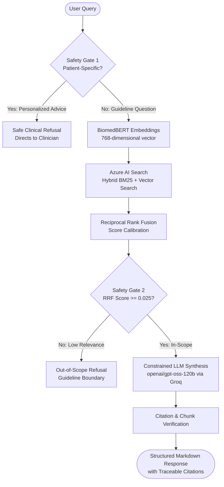

# SickleSense

> **AI-Powered Knowledge & Clinical Evidence Assistant for Sickle Cell Care**  
> *Developed by Team **MINOR THREAT 2026***

[](https://O-076.github.io/sicklesense/)
[](https://sicklesense-api-dgh3aqdwb3eghdc4.swedencentral-01.azurewebsites.net/health)
[](https://huggingface.co/NeuML/biomedbert-base-embeddings)
[](https://groq.com/)

---

## 1. Overview

**SickleSense** is a citation-bound clinical Retrieval-Augmented Generation (RAG) assistant for sickle cell disease (SCD). It is designed to act as a **"Clinical Margin Note"**—a fast, calm, evidence-first reference tool for clinicians, hematologists, and healthcare learners to cross-reference guideline recommendations under time pressure.

Every answer generated by SickleSense is strictly constrained to the indexed clinical corpus, with transparent, traceable page-level citations and chunk identifiers (`doc-CH-XXXX`).

---

## 2. Core Features

- **Hybrid Reciprocal Rank Fusion (RRF)**: Combines dense vector retrieval via `NeuML/biomedbert-base-embeddings` (768 dimensions) with lexical BM25 keyword matching in Azure AI Search to prevent keyword-misses on complex SCD acronyms (TCD, VOC, ACS, HbS).
- **Constrained Synthesis**: The LLM (`openai/gpt-oss-120b`) is instructed with a Grounding System Prompt requiring all claims to be backed by retrieved text.
- **Two-Tier Safety Architecture**:
  1. *Patient-Specific Filter*: Detects individualized medical inquiries (e.g. *"what dose should I give my child?"*) and refuses to prevent unauthorized clinical advice.
  2. *Relevance Score Gating*: Out-of-scope questions scoring below a calibrated threshold (`0.025`) return clear refusals rather than speculative answers.
- **Traceable Provenance**: Citations explicitly include publication title, section name, verified page number, and chunk ID.
- **Modern User Experience**: Responsive web interface with interactive markdown rendering (tables, lists, alerts), live FastAPI health monitoring, and a dedicated Support & FAQ center.

---

## 3. Indexed Clinical Corpus

SickleSense indexes three authoritative clinical source documents:

| Document | Organization / Journal | Scope | Key Topics Covered |
|---|---|---|---|
| **NHLBI 2014 Report** | National Heart, Lung, and Blood Institute (NIH) | Comprehensive Clinical Guideline | Hydroxyurea initiation thresholds, annual TCD stroke screening, acute chest syndrome management, transfusion protocols, renal monitoring. |
| **JCM 2024 Study** | Journal of Clinical Medicine | Multicenter Retrospective Cohort | Age-stratified clinical manifestations, splenic disease prevalence, hospital length of stay, ICU admission epidemiology (Taif cohort). |
| **WHO 2026 Guidelines** | World Health Organization (Geneva) | Pediatric SCD Guidelines | Newborn screening, penicillin prophylaxis, malaria prevention in endemic zones, growth/nutrition monitoring, universal pediatric hydroxyurea dosing. |

---

## 4. System Architecture



---

## 5. Repository Structure

```text
├── src/                          # Frontend React source code
│   ├── main.jsx                  # Main application component & SPA routing
│   └── styles.css                # Custom CSS design system (Navy + Crimson theme)
├── public/                       # Static public assets (mascot, icons)
│   ├── mascot.png
│   └── logo-wide.png
├── sicklesense-backend/          # Production FastAPI backend application
│   ├── app/
│   │   ├── main.py               # FastAPI entrypoint, CORS & routes
│   │   ├── config.py             # Pydantic Settings & environment loader
│   │   ├── models/
│   │   │   └── schemas.py        # Pydantic request/response schemas
│   │   └── services/
│   │       ├── search_service.py # Azure AI Search client & hybrid query runner
│   │       ├── rag_engine.py     # Prompt construction & Groq integration
│   │       ├── safety.py         # Regex patient-safety filtering
│   │       └── llm_service.py    # LLM completion helpers
│   ├── Dockerfile                # Container definition for Azure App Service
│   ├── requirements.txt          # Python backend dependencies
│   └── .env.example              # Example environment variables template
├── index.html                    # Root HTML document
├── vite.config.js                # Vite build configuration (base: './')
├── package.json                  # Node.js dependencies and scripts
└── .github/workflows/deploy.yml  # GitHub Actions deployment to GitHub Pages
```

---

## 6. Frontend Setup & Execution

The frontend is built with **React**, **Vite**, **Lucide Icons**, and **React-Markdown** with **Remark-GFM**.

### Prerequisites
- Node.js 20+
- npm 10+

### Local Development

```bash
# 1. Install dependencies
npm install

# 2. Start local development server
npm run dev
```

Visit `http://localhost:5173/` in your browser.

### Production Build

```bash
npm run build
npm run preview
```

---

## 7. Backend Setup & Execution

The backend is built with **FastAPI**, **Azure AI Search Python SDK**, **LangChain HuggingFace Embeddings**, and **Groq Cloud SDK**.

### Prerequisites
- Python 3.10+
- Azure AI Search instance with an indexed SCD collection
- Groq API Key

### Local Development

```bash
cd sicklesense-backend

# 1. Create and activate a virtual environment
python -m venv .venv
source .venv/bin/activate  # On Windows: .venv\Scripts\activate

# 2. Install dependencies
pip install -r requirements.txt

# 3. Configure environment variables
cp .env.example .env
# Edit .env with your Azure Search and Groq credentials

# 4. Start the FastAPI server
uvicorn app.main:app --host 0.0.0.0 --port 8000 --reload
```

Interactive API documentation will be available at `http://localhost:8000/docs`.

---

## 8. API Reference

### Base URL
- **Production API**: `https://sicklesense-api-dgh3aqdwb3eghdc4.swedencentral-01.azurewebsites.net`

### Endpoints

#### `GET /health`
Verifies backend availability, vector index connection, and active model configuration.

**Response (`200 OK`):**
```json
{
  "status": "healthy",
  "model": "openai/gpt-oss-120b",
  "index": "creativa-hackathon-pc"
}
```

#### `POST /api/query`
Executes hybrid search across indexed guidelines and returns a grounded clinical response.

**Request Body:**
```json
{
  "query": "When should hydroxyurea be started in adults with sickle cell anemia?",
  "top_k": 5
}
```

**Response (`200 OK`):**
```json
{
  "query": "When should hydroxyurea be started in adults with sickle cell anemia?",
  "answer": "### Hydroxyurea Initiation in Adults\n\nHydroxyurea therapy is strongly recommended for adults with sickle cell anemia (SCA) who meet any of the following criteria:\n\n- **>= 3 moderate-to-severe pain crises** (vaso-occlusive episodes) in a 12-month period.\n- **Recurrent acute chest syndrome (ACS)** episodes.\n- Severe, symptomatic chronic anemia affecting daily functioning.",
  "sources": [
    {
      "chunk_id": "nhlbi-scd-2014-CH-0396",
      "parent_id": "nhlbi-scd-2014-P0077",
      "document_id": "nhlbi-scd-2014",
      "title": "Evidence-Based Management of Sickle Cell Disease: Expert Panel Report, 2014",
      "citation": "National Heart, Lung, and Blood Institute (2014)...",
      "section": "Hydroxyurea Therapy",
      "page_number": 77,
      "score": 0.0332
    }
  ]
}
```

---

## 9. Evaluation & Benchmarks

The retrieval and generation pipeline was evaluated against a 20-question labeled clinical benchmark across 5 categories (direct, paraphrased, abbreviation/threshold, management-process, and out-of-scope):

- **Precision@3**: `0.500`
- **Precision@5**: `0.463`
- **False-Relevance Rate on Out-of-Scope Queries**: `0.000` (100% rejection rate on unrelated queries)
- **Optimal Chunking Configuration**: 800 characters, 150 character overlap

---

## 10. Team & Credits

Developed with care for the Creativa SCD Hackathon by **MINOR THREAT 2026**.

*Disclaimer: SickleSense is intended exclusively for clinical education and guideline reference. It does not provide individualized medical advice or replace the clinical judgment of licensed healthcare providers.*
